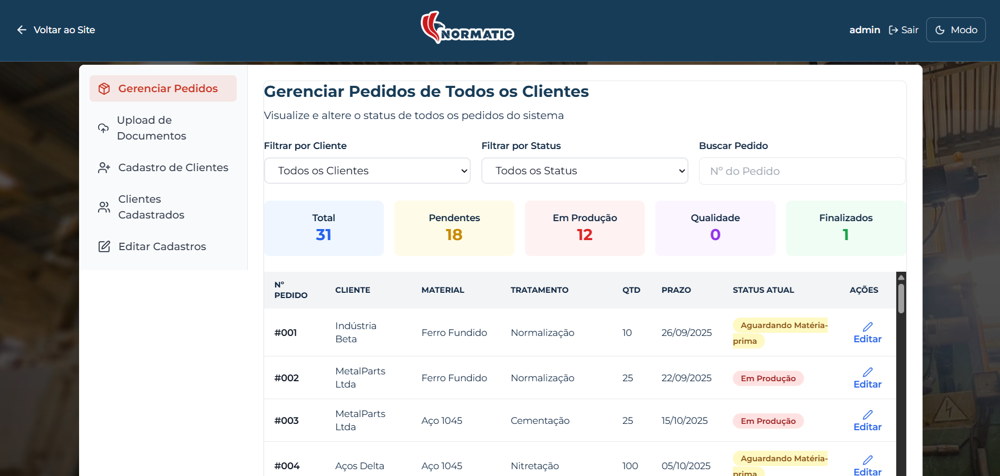

# MyNormatic
### Corporate Management System (Academic Prototype)

## 🖥️ System Preview


## 🔗 Quick Access
🌐 Live System (Vercel):  
https://mynormatic-system.vercel.app/index.html  

🎥 Functional System Demonstration:  
https://www.youtube.com/watch?v=kAtX-vin9tE  

🏆 Academic Pitch – Learning Journeys Award:  
https://www.youtube.com/watch?v=qyNjXZFt5Fs  

---

## 📌 Overview
MyNormatic is a web-based corporate management system developed during a Software Engineering academic project in partnership with the company Normatic.

The platform was designed as a functional prototype of a corporate digital ecosystem, centralizing workflows, organizational data, user roles and intelligent assistance modules in a single unified interface.

Rather than a simple academic project, MyNormatic was conceived as a **mini ERP prototype**, focused on process organization, internal management simulation and future integration with real enterprise systems.

---

## 🎯 Project Objective
The main objective of MyNormatic is to simulate a structured corporate environment capable of organizing operational processes, user roles and internal workflows within a digital platform.

The system demonstrates:
- Corporate system architecture concepts
- Role-based access control
- Data-driven interface behavior
- Intelligent assistant integration
- Future ERP scalability vision

---

## 🌐 Live System (Online Demonstration)
The system is fully deployed and accessible online:

🔗 https://mynormatic-system.vercel.app/index.html  

Recommended flow:
1. Access the landing page
2. Click on **"Acessar Site"**
3. Log in using one of the demo credentials below
4. Explore the corporate ecosystem modules

---

## 🏢 Corporate Ecosystem Structure
MyNormatic simulates a real corporate digital ecosystem composed of multiple organizational roles:

- 👑 Administrator
- 👨‍💼 Managers (Gestores)
- 👷 Collaborators (Colaboradores)
- 🤝 Clients (Clientes)

Each role represents a different interaction layer within a company environment, similar to enterprise management systems.

---

## ⚙️ Core System Features

### 🖥️ Integrated Corporate Interface
- Centralized system dashboard
- Modular navigation structure
- Corporate-style UI/UX
- Multi-section operational panels

### 📊 Excel-Based Data Layer (Database Simulation)
The system uses Excel files as a simulated database:
- Dynamic data loading via JavaScript
- Structured login validation
- Safe academic data environment
- No dependency on external database servers

This architecture was intentionally designed to replicate real data-driven systems in an academic context.

---

## 🔐 System Access & Authentication (Official Demo Credentials)

MyNormatic uses a **hybrid authentication model**:
- Fixed authentication for Administrator, Manager and Collaborator
- Dynamic authentication for Clients via Excel database (`base_dados.xlsx`)

All credentials and data are fictional and used exclusively for academic and demonstration purposes.

---

### 👑 Administrator Access (Full System Control)
- User Type: Admin  
- Login: admin  
- Password: 123  

Access Scope:
- Full system navigation
- Administrative panels
- Corporate ecosystem overview
- System structure visualization

---

### 👨‍💼 Manager (Gestor) Access
- User Type: Gestor  
- Login: gestor (or any username)  
- Password: 123  

Access Scope:
- Management dashboards
- Operational visualization modules
- Internal workflow monitoring
- Strategic interface sections  

Note: Manager authentication is role-based and validated by system logic.

---

### 👷 Collaborator (Colaborador) Access
- User Type: Colaborador  
- Login: colaborador (or any username)  
- Password: 123  

Access Scope:
- Internal operational features
- Workflow interaction modules
- Employee system perspective

---

### 🤝 Client Access (Excel Database Authentication)
Client accounts are dynamically validated through the Excel data layer (`base_dados.xlsx`).

Valid demo client accounts:
- Login: beta | Password: 12345678  
- Login: metalparts | Password: 12345678  
- Login: delta | Password: 12345678  
- Login: tratofer | Password: 12345678  
- Login: gama | Password: 12345678  

Recommended account for richer data visualization:
- **metalparts**

---

### 📌 Technical Authentication Note
- Administrator, Manager and Collaborator roles use fixed authentication logic inside the system
- Client access is dynamically loaded from the Excel database
- No real corporate database is used (academic prototype)
- All credentials are fictional and safe for public repository use

---

## 🤖 AI Integration (Dual Intelligent Agents)

MyNormatic includes two AI-assisted modules designed to simulate intelligent corporate support tools within the system.

### 🧠 Normatic Assistant
- Contextual user guidance
- System interaction support
- Interface assistance simulation

### 🛠️ Technical Consultant AI
- Technical analysis simulation
- Process-oriented assistance
- Operational support logic

### 🔒 AI Demo Mode (Security-Oriented)
For security and best practices:
- API keys are NOT stored in the repository
- AI operates in optional demo mode
- The system remains fully functional without AI activation

To enable AI locally (optional):
```js
localStorage.setItem('GEMINI_API_KEY_NORMATIC','YOUR_API_KEY');
localStorage.setItem('GEMINI_API_KEY_CONSULTANT','YOUR_API_KEY');
